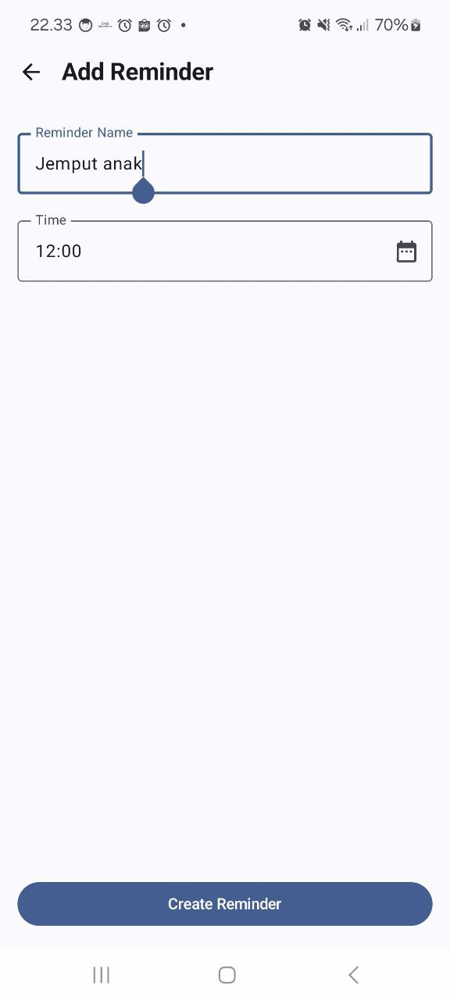
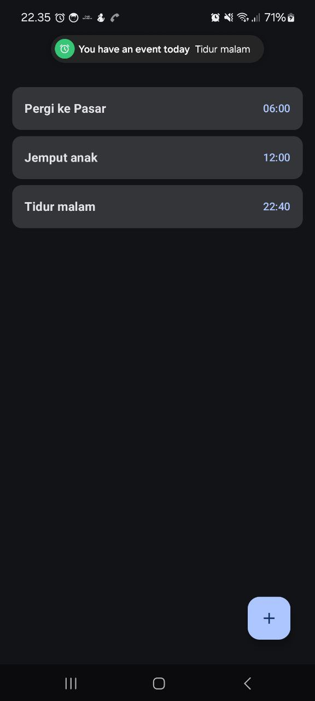
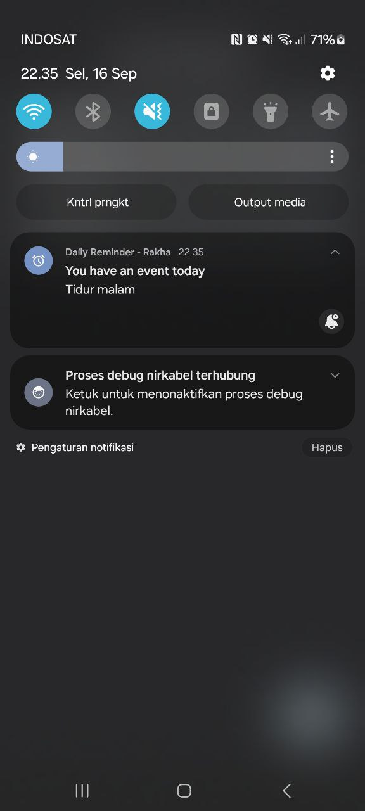
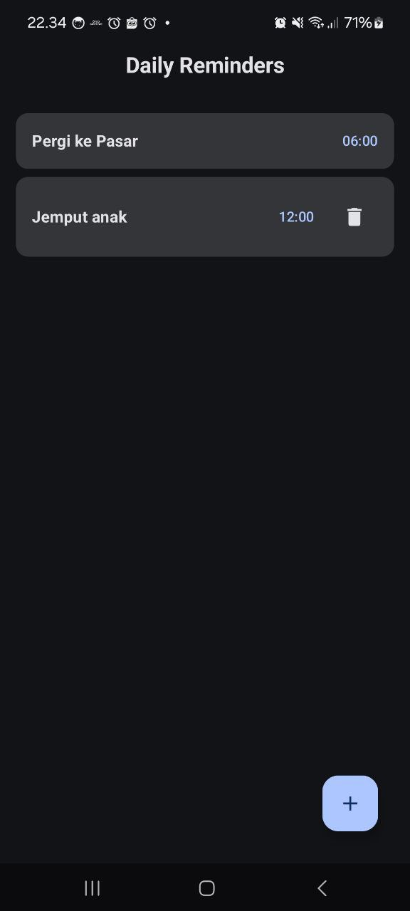

# Daily Reminder App

A simple Android application built with Kotlin and Jetpack Compose that allows users to create and manage daily reminders with automatic notifications.

## Screenshots

## Features

- ✅ Create daily reminders with title and time
- ✅ View all reminders in a single list
- ✅ Delete reminders
- ✅ Automatic notifications 10 minutes before scheduled time
- ✅ Persistent scheduling (works after app restart/device reboot)
- ✅ Modern Material Design 3 UI
- ✅ Dark mode support

## Tech Stack

- **Language**: Kotlin
- **UI Framework**: Jetpack Compose
- **Architecture**: MVVM with Clean Architecture
- **Database**: Room (SQLite)
- **Dependency Injection**: Koin
- **Background Tasks**: WorkManager
- **Navigation**: Navigation Compose
- **MockK**: Unit Testing
